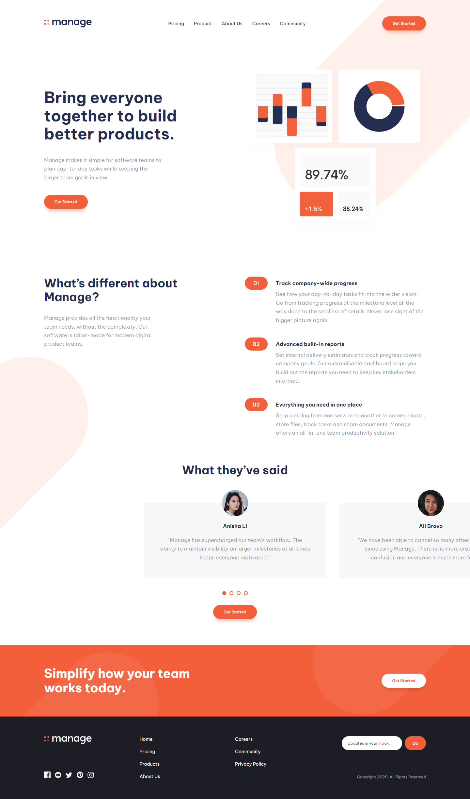

# Frontend Mentor - Manage landing page solution

This is a solution to the [Manage landing page challenge on Frontend Mentor](https://www.frontendmentor.io/challenges/manage-landing-page-SLXqC6P5). Frontend Mentor challenges help you improve your coding skills by building realistic projects. 

## Table of contents

- [Overview](#overview)
  - [The challenge](#the-challenge)
  - [Screenshot](#screenshots)
  - [Links](#links)
- [My process](#my-process)
  - [Built with](#built-with)
  - [What I learned](#what-i-learned)
  - [Continued development](#continued-development)
  - [Useful resources](#useful-resources)
- [Author](#author)

## Overview

### The challenge

Users should be able to:

- View the optimal layout for the site depending on their device's screen size
- See hover states for all interactive elements on the page
- See all testimonials in a horizontal slider
- Receive an error message when the newsletter sign up `form` is submitted if:
  - The `input` field is empty
  - The email address is not formatted correctly

### Screenshots
`Desktop`

`Mobile`

### Links

- Solution URL: [Add solution URL here](https://your-solution-url.com)
- Live Site URL: https://manage-landing-page-master-ochre.vercel.app/

## My process

### Built with

- Semantic HTML5 markup
- CSS custom properties
- Flexbox
- CSS Grid
- Javascript (DOM, OOP, Regex)

### What I learned

On this project I decided to use the basis of web development and create a website only using HTML, CSS and Javascript, without adding any external external libraries or frameworks, and I was able to get more knowledge working with Regex and learn more about some of the things it let us to do.

Also, I had the opportunity of creating a slider from scratch using pure javascript code with OOP, it wasn't necessary to create that slider using javascript classes but in another situation it can be used to create how many instances of the slider we need.

### Continued development

My next steps will be to improve my ability to create more complex interactions and data featching from external APIs.

### Useful resources

- [Regex101](https://regex101.com/) - This website helped me to test my regex code and the quick reference on is good to find what exactly you need to do what you want.

## Author

- Frontend Mentor - [@AsafeToschi](https://www.frontendmentor.io/profile/AsafeToschi)
- [LinkedIn](https://www.linkedin.com/in/asafe-luiz-de-paula-toschi-b63342198)

